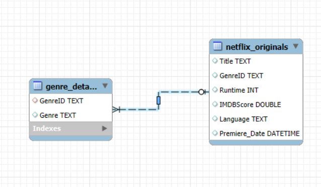

# 🎬 Netflix Originals Data Analysis: Exploring Trends and Insights

Welcome to a comprehensive SQL-based analytical project focused on Netflix Originals. This study explores viewer reception, genre-based content performance, and runtime trends by leveraging IMDb ratings and genre metadata. Using structured queries and datasets, the analysis uncovers patterns that help us understand how Netflix produces and promotes its original content.

---

## 🗂️ Database Schema

The project uses a normalized schema consisting of two related tables: `netflix_originals` and `genre_details`, connected by `GenreID`.

---

## 📌 Objectives

- Evaluate IMDb score distributions across genres.
- Identify high-performing genres and standout content.
- Explore relationships between runtime and content depth.
- Rank titles within genres based on audience ratings.
- Assess Netflix’s genre-wise content investment.
- Discover genres consistently delivering critically acclaimed titles.

---

## 🧠 Analytical Questions & Findings

### 1. What is the average runtime of Netflix Originals for each genre?
- **Approach**: Understanding average runtime helps identify content length preferences in each genre.
- **Conclusion**: The analysis reveals runtime expectations across genres, aiding in content planning.

---

### 2. Which languages have more than 10 Netflix Originals, and what is their average IMDb score?
- **Approach**: This helps identify languages with a substantial number of releases and their viewer reception.
- **Conclusion**: The result highlights which non-English languages have stronger representation and quality.

---

### 3. What are the top 5 genres with the most Netflix Originals?
- **Approach**: This highlights Netflix's focus genres.
- **Conclusion**: The outcome shows the most favored content types by production volume.

---

### 4. Which titles released after 2020 have an IMDb score greater than 8.0?
- **Approach**: It helps identify standout content in recent years.
- **Conclusion**: These insights can help recommend quality, recent content to users.

---

### 5. Which genre has the most titles in languages other than English?
- **Approach**: It highlights genre diversity in international content.
- **Conclusion**: Results showcase Netflix’s strongest genre in non-English markets.

---

### 6. What is the latest title per genre?
- **Approach**: This approach identifies the most recent release in each genre.
- **Conclusion**: It gives insight into the freshest content Netflix has released across genres.

---

### 7. Which titles are longer than the average runtime of their genre?
- **Approach**: This identifies outliers or detailed productions in each genre.
- **Conclusion**: It can suggest deeper or more elaborate stories that stand out from the average.

---

### 8. How many Netflix Originals were released each year and what is the average IMDb score?
- **Approach**: This shows trends in production volume and viewer reception over time.
- **Conclusion**: We see Netflix’s growth over years and changes in content quality.

---

### 9. Which genres have titles in the top 10% of IMDb scores?
- **Approach**: This reveals genres that contribute to critically acclaimed content.
- **Conclusion**: Genres identified here show high-quality, top-performing Netflix Originals.

---

### 10. Which genres have a minimum IMDb score greater than 6.5?
- **Approach**: It ensures a baseline of quality across all titles within a genre.
- **Conclusion**: These genres consistently perform well in viewer ratings.

---

## 🛠️ Tools Used

- **MySQL** (Query Development)
- **MySQL Workbench** (Schema Design & Visualization)
- **Google Sheets / Excel** (Result Presentation)

---

## 📈 Conclusion

This project uncovered how Netflix distributes its creative efforts across genres, what viewers prefer, and which content categories consistently perform well. The analytical process serves as a blueprint for content strategists, data analysts, and entertainment researchers looking to understand media trends using SQL.

---

## 🙌 About the Author

**By:** Tejaswini Srikireddy  
📧 Email: [srikireddytejuteju@gmail.com](mailto:srikireddytejuteju@gmail.com)  
🔗 LinkedIn: [Tejaswini Srikireddy](http://www.linkedin.com/in/tejaswini-srikireddy-891b2126b)

---

> Thank you for exploring this project! ⭐ If you found it helpful, feel free to give it a star and connect with me!
